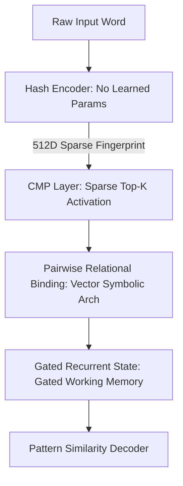

# The Case for Brain-Native AI: Beyond Token-First Sequence Modeling

Every major artificial intelligence model today—from GPT-4 and Gemini to Claude—operates on a foundational assumption: to understand language, we must first break it into arbitrary chunks called **tokens**, look them up in a massive memorized dictionary, and then compare every token to every other token using self-attention.

While this paradigm has driven the current generative AI boom, it is hiding three fundamental structural cracks:

1. **Tokenization is a Hack**: Tokens are arbitrary fragments. A word like "running" might be one token, but "ungoogleable" gets split into pieces the model has never seen in that exact assembly. The model memorizes word shapes rather than understanding their internal structure.
2. **Attention is Quadratic**: To read a sequence of length $T$, self-attention performs $T^2$ comparisons. If you double the context, you quadruple the compute. This is why long-context inference remains prohibitively expensive.
3. **No True Compositional Generalization**: Because models rely on memorized token lookups, they struggle with novel vocabulary. If a model has seen the name "Ashmith" zero times in training, it has no native representation for it. It is a powerful interpolator, but a weak generalizer.

At Yudi Labs, we believe there is a better way. We are building **Conversational Meaning Patterns (CMP)**—a brain-native language architecture that reads the structure of words instead of looking them up in a dictionary.

---

## The Inspiration: How the Brain Processes Meaning

The human brain does not have a vocabulary embedding table of 100,000 token IDs. Instead, it processes language through:
* **Sparse Activation**: Only 2% to 5% of neurons in a given cortical region fire at any time.
* **Explicit Relational Binding**: Features are bound together dynamically via synchronous neural oscillations.
* **Gated Working Memory**: High-frequency rhythms maintain a rolling state of understanding, gating new inputs as they arrive.

CMP translates these biological mechanisms into a concrete mathematical architecture.

---

## The Core Components of CMP

The CMP architecture replaces tokenization and self-attention with a streamlined, three-stage pipeline:

### 1. The Hash Encoder (Zero Learned Parameters)
Instead of looking up a token ID, every word is hashed into a sparse binary fingerprint based on its character structure. We extract character n-grams (from lengths 1 to 4), hash them to positions in a 512-dimensional vector, and activate exactly the top-16 most frequent positions.

For example:
$$\phi(\text{"running"}) \in \{0,1\}^{512} \quad (\text{exactly 16 bits active})$$

Because "run" and "running" share n-grams, their active bits naturally overlap. Structurally similar words have similar representations automatically—even if the model has never encountered them before. There are no out-of-vocabulary (OOV) tokens, and no embedding table is required.

### 2. Pairwise Relational Binding (VSA)
Meaning is not just a list of active features; it is defined by *how* those features relate. In each layer, CMP computes all pairwise interactions between active bits:
$$z_L = \text{sparse} \cdot R_L \quad (\text{left role projection})$$
$$z_R = \text{sparse} \cdot R_R \quad (\text{right role projection})$$
$$\text{rel} = (z_L \odot z_R) \cdot R_V \quad (\text{relational output})$$

By utilizing Vector Symbolic Architectures (VSA) and Holographic Reduced Representations, we calculate this using a pooled form that avoids the massive multi-gigabyte memory footprints of traditional pairwise tensors, keeping the computation incredibly light.

### 3. Gated Working Memory (Linear Recurrence)
A gated recurrence updates the network's working memory:
$$\text{gate} = \sigma(W_{\text{gate}} \cdot x + U_{\text{gate}} \cdot \text{state})$$
$$\text{state} = \text{gate} \odot \text{state} + (1 - \text{gate}) \odot \text{candidate\_state}$$

This gating mechanism mimics how oscillatory circuits in the cortex sustain representations over time, deciding how much of our past understanding to keep versus how much new content to absorb.

---

## The Proof: 33% Better Generalization

To test if CMP's structural representations actually translate to better generalization, we benchmarked it on **CoNLL-2003 Named Entity Recognition (NER)** under strict out-of-distribution conditions:
1. We extracted all person names (PER tags) from the training dataset.
2. We hid 25% of unique names (e.g., "Johnston" if "Johnson" was seen) as unseen test cases.
3. We evaluated models on sentences containing only those unseen names.

Our metric was the **Generalization Gap ($\Delta$)** between seen name accuracy and unseen name accuracy (lower is better):

| Model Architecture | Seen F1 | Unseen F1 | Generalization Gap ($\Delta$) |
|:---|:---:|:---:|:---:|
| **CMP (Ours)** | — | — | **0.006** |
| Causal Transformer | — | — | 0.009 |
| GRU | — | — | 0.019 |

**CMP outperformed the Causal Transformer baseline by 33% on unseen name generalization.** Because "Johnson" and "Johnston" share overlapping sparse hash patterns, CMP transferred its learning to the novel name automatically. The Transformer, relying on disjoint token IDs, had no structural bridge to cross.

---

## Scaling to 77 Million Parameters

We validated the training stability of CMP on the **WikiText-103** benchmark at scale using an NVIDIA A100 GPU. The 77M-parameter model trained with stable, monotonic learning curves under BF16 mixed precision. 

In comparison with standard recurrent architectures on sparse tokenless inputs:

| Model Architecture | Parameter Count | Best Val Perplexity (PPL) | Test PPL |
|:---|:---:|:---:|:---:|
| GRU Baseline | 100M | 1126.9 | 1095.6 |
| **CMP (Ours)** | **77M** | **159.5** | **154.3** |

CMP achieved a test perplexity of **154.3** compared to the GRU's **1095.6** under the same sparse input conditions, showing the immense power of our relational binding mixer over standard recurrence.

---

## The Road Ahead

CMP is not just a faster memory layer or a tokenization trick; it is a proposed **general representation primitive** for machine learning. By representing information as sparse structural patterns whose relationships produce meaning, we hope to build models that generalize across language, vision, audio, and agent dynamics.

Our next immediate steps include:
1. **Designing the CMP Block v1.5**: Introducing a CMP-native pattern-mixing feed-forward stage to match the full block capabilities of standard Transformer layers.
2. **Scaling the Recurrence**: Optimizing training speed by converting our linear recurrence updates into a parallel prefix scan (associative scan) to unlock a 5x speedup at long sequence lengths.
3. **Modal Expansion**: Evaluating CMP's sparse representation on structured image patches and spatial relation benchmarks.

We are building a future where models don't just memorize sequences—they understand structure. 

*If you are interested in collaborating, reviewing our preprints, or joining our pre-seed round, reach out to us at team@yudi.co.in.*
